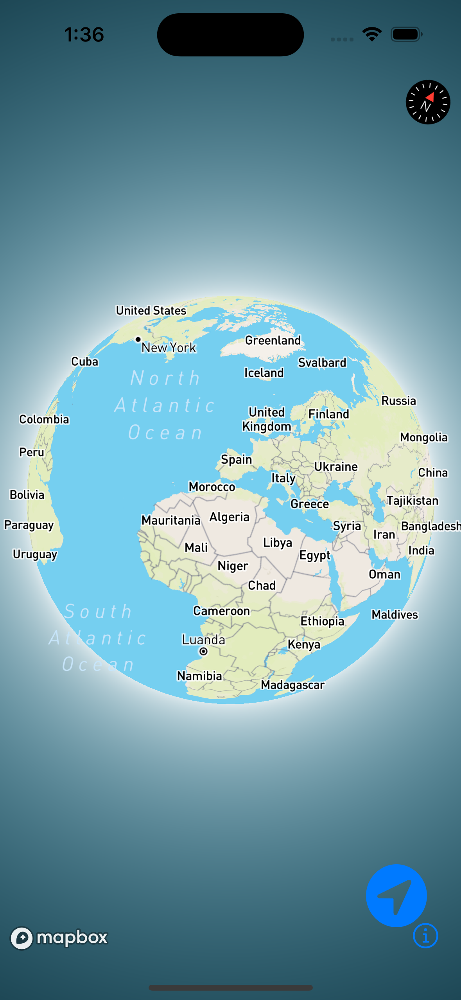

[![Swift Version][swift-image]][swift-url]

# 3DEarth
 

  

    Show a map with 3d globe projectio where you can zoom in, zoom out or view other locations around the world.
  

## Features

- [x] Map can be viewed in globe projection (3d Earth)
- [x] Show user's location (if user allows location persmission)
- [x] Display pin of coordinate 35.36093601891445, 138.72395921727045

## Requirements

- iOS 15.0+
- Xcode 14.2

## Installation

Uses Cocoapods as dependecy package manager

Clone the repository and then just run `pod install` in terminal.

## Meta

Aaron Musa

[https://github.com/aaronmusa](https://github.com/aaronmusa)

[swift-image]:https://img.shields.io/badge/swift-5.0-orange.svg
[swift-url]: https://swift.org/
